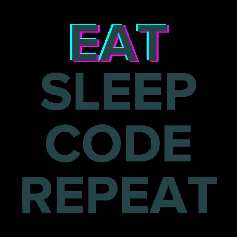

 
  
 
    
    <h1 align="center"><em>Most Used Technologies</em></h1>
    
     
    
    
    
     
    
    
    
   

    
  <h1 align="center"><em>Social Media</em></h1>
    
    
    
    

  

<table>
  <tr>
    <td></td>
    <td></td>
  </tr>
</table>

 

 
  <h1 align="center"><em>In learning</em></h1>
  
  
  
  

 

 
<b>Visitors Count</b>
  

 

